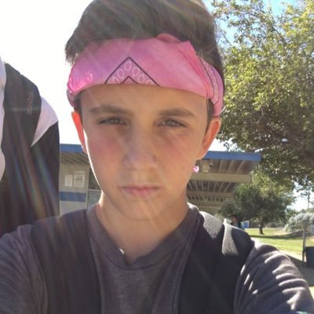

# **Luke Skerrett**
## *3rd year Math/CS Major*

(picture taken today)

### About Me
Hello Classmates! I am third year Math/CS major and an aspring software engineer. My favorite movies are the `Star Wars` with my favorite charatcer being Yoda.

> To do or do not, there is no try.

You can check out my Linkedin [here](https://www.linkedin.com/in/luke-skerrett/) and pirate Star Wars movies [here](https://www.youtube.com/watch?v=GPXkjtpGCFI).

If you wanna find out my favorite programming language, well, your gonna have to go check out my [README](README.md)!

### List Time
Some of my favorite foods include:
- Sushi
- Chocolate Chip Cookies
- Sugar Mangoes

I love to play && watch sports, with my ranking as follows:
1. Basketball
2. Football
3. Tennis
4. Programming

My career goals are: 
- [x] Take CSE 110 with Powell
- [ ] Pass CSE 110 with Powell
- [ ] Create an awesome project with Powell
- [x] Be Awesome

I hope you enjoyed learning about myself through my webpage! I wish you the best.